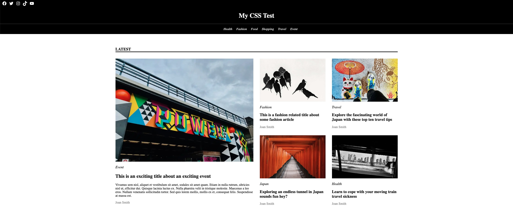

## Welcome to the CSS Tester!

## What is the purpose of this lesson

1. CSS Fundamentals

   - alignment of items both vertical and horizontal
   - sharing and not sharing styles using selector syntax
   - grids and flexes, aligning, defining and tweaking
   - headers, links, images, blocks, etc etc etc

2. CSS In React using Styled Components

   - Understanding the "correct"/Lloyds way to do CSS in React
   - How to share styles with styled components
   - How to control styles with custom props

3. Componentising HTML properly using React
   - Data and display separations
   - Layout components
   - How to reuse types in component props
   - How to connect styled components and components

## The exercise

### PART 1 - We're going back to 1999

The world is worrying about the Year 2000 bug, Ricky Martin and Destiny's Child are tearing up the charts and React is yet to exist!

We need you to style a static website like it is 1999!

1. Go into file Explorer and load `index.html` in the Chrome Browser
2. Make it look like this:

with extra points if you can also do the bonus section (which is straight after the main section)

Open the image at full size to get an idea (don't use the preview version that is resized)

3. We are using bog standard CSS in one file `styles.css` (already there, already linked) using class names etc. Don't use anything like Styled components, SASS etc this first part is not a test of that, it's a test of CSS fundamentals...

### PART 2 - Present Day - lets build this in React/styled components

I have created a `react-css` project which is blank except for an `App` component and the file `src/magazine data/magazinePage.ts` which contains all the data and types you need to build the website as a set of React components.

I want you to build it with the following concepts in mind:

- Lots of components with as much reuse as possible
- Styled components for all stying (I'll let you put `margin:0` in the index.css but that is it!)

This may feel like a trivial exercise but if you really knuckle down and work through it, you will learn SO much about component structure!

### PART 3 - Present Day - lets have chat

It's worth having a good look at both solutions side by side

1. Which do we feel is the "best" solution?
2. Which is "safer"?
3. What would be easier to support?
4. What would be easier to make interactive?
5. What would be easier to replace with a different CMS/back end?
6. What would be easier/better to test?
